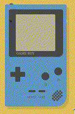

<a id="readme-top"></a>
<!--
*** Thanks for checking out the Best-README-Template. If you have a suggestion
*** that would make this better, please fork the repo and create a pull request
*** or simply open an issue with the tag "enhancement".
*** Don't forget to give the project a star!
*** Thanks again! Now go create something AMAZING! :D
-->


<!-- PROJECT SHIELDS -->
<!--
*** I'm using markdown "reference style" links for readability.
*** Reference links are enclosed in brackets [ ] instead of parentheses ( ).
*** See the bottom of this document for the declaration of the reference variables
*** for contributors-url, forks-url, etc. This is an optional, concise syntax you may use.
*** https://www.markdownguide.org/basic-syntax/#reference-style-links
-->
[![Contributors][contributors-shield]][contributors-url]
[![Forks][forks-shield]][forks-url]
[![Stargazers][stars-shield]][stars-url]
[![Issues][issues-shield]][issues-url]
[![Unlicense License][license-shield]][license-url]
<!-- [![LinkedIn][linkedin-shield]][linkedin-url] -->

<!-- PROJECT LOGO -->
<br />
<div align="center">
  <a href="https://github.com/Majestic9169/ppGB-emu">
    
  </a>

  <h3 align="center">ppGameBoy Emulator</h3>

  <p align="center">
    A GameBoy emulator written in C++
    <br />
    <!-- <a href="https://github.com/Majestic9169/ppGB-emu/wiki"><strong>Explore the docs »</strong></a> -->
    <!-- <br /> -->
    <br />
    <!-- <a href="https://github.com/Majestic9169/ppGB-emu">View Demo</a> -->
    <!-- &middot; -->
    <a href="https://github.com/Majestic9169/ppGB-emu/issues/new?labels=bug&template=bug-report---.md">Report Bug</a>
    &middot;
    <a href="https://github.com/Majestic9169/ppGB-emu/issues/new?labels=enhancement&template=feature-request---.md">Request Feature</a>
  </p>
</div>

<!-- TABLE OF CONTENTS -->
<details>
  <summary>Table of Contents</summary>
  <ol>
    <li>
      <a href="#about-the-project">About The Project</a>
      <ul>
        <li><a href="#built-with">Built With</a></li>
      </ul>
    </li>
    <li>
      <a href="#getting-started">Getting Started</a>
      <ul>
        <li><a href="#prerequisites">Prerequisites</a></li>
        <li><a href="#installation">Installation</a></li>
        <li><a href="#usage">Usage</a></li>
        <li><a href="#tests">Tests</a></li>
      </ul>
    </li>
    <li><a href="#top-contributors">Top Contributors</a></li>
  </ol>
</details>
 
---

<!-- ABOUT THE PROJECT -->
## About The Project

ppGB (plus plus GameBoy emulator) is a GameBoy Emulator written in C++. 

This project aims to implement a basic featured Gameboy Emulator that will allow the user to play simple games like Tetris at their convenience, while exhibiting good software engineering practices like version control, build systems, documentation, etc.

<p align="right">(<a href="#readme-top">back to top</a>)</p>

### Built With

[](#)

<p align="right">(<a href="#readme-top">back to top</a>)</p>

---

<!-- GETTING STARTED -->
## Getting Started

### Prerequisites

This project uses ~~SDL3~~ SDL2 and Catch2 v3 as dependencies

You can install SDL2 on Arch Linux from the extra repository as 

```bash
sudo pacman -S sdl2
```

On linux mint and similar systems

```bash
sudo apt-get install libsdl2-2.0.0
```

You can build Catch2 v3 from source as 

```bash
git clone https://github.com/catchorg/Catch2.git
cd Catch2
cmake -Bbuild -H.
sudo cmake --build build --target install
```

> [!CAUTION]
> SDL3 is newly released and not stable. Up until April 3rd 2025 I was trying to use SDL3 not realising that it simply was not functional yet (or i was just messing up really bad)

### Usage

a `build.sh` convenience script is provided. You can set `$ROM` in the script then use as below

```bash
Usage
  ./build.sh to build main executable and tests
  ./build.sh -r to run $ROM
  ./build.sh -d to run $ROM with debug information printed
  ./build.sh -t to run tests on a default rom you can set in `./tests/test_globals.cpp`
  ./build.sh -c to clean the build folder
```

this is currently for convenience in developing, i will make this easier to use later

---

<!-- CONTRIBUTING -->
## Top contributors

<a href="https://github.com/Majestic9169/ppGB-emu/graphs/contributors">
  
</a>

<p align="right">(<a href="#readme-top">back to top</a>)</p>

<!-- APPENDIX -->
## Acknowledgements

- [GameBoy GIF](https://codepen.io/heero/pen/DpBZzz)

---

<!-- MARKDOWN LINKS & IMAGES -->
<!-- https://www.markdownguide.org/basic-syntax/#reference-style-links -->
[contributors-shield]: https://img.shields.io/github/contributors/Majestic9169/ppGB-emu.svg?style=for-the-badge
[contributors-url]: https://github.com/Majestic9169/ppGB-emu/graphs/contributors
[forks-shield]: https://img.shields.io/github/forks/Majestic9169/ppGB-emu.svg?style=for-the-badge
[forks-url]: https://github.com/Majestic9169/ppGB-emu/network/members
[stars-shield]: https://img.shields.io/github/stars/Majestic9169/ppGB-emu.svg?style=for-the-badge
[stars-url]: https://github.com/Majestic9169/ppGB-emu/stargazers
[issues-shield]: https://img.shields.io/github/issues/Majestic9169/ppGB-emu.svg?style=for-the-badge
[issues-url]: https://github.com/Majestic9169/ppGB-emu/issues
[license-shield]: https://img.shields.io/github/license/Majestic9169/ppGB-emu.svg?style=for-the-badge
[license-url]: https://github.com/Majestic9169/ppGB-emu/blob/master/LICENSE.txt
