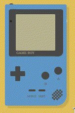
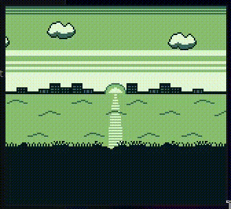
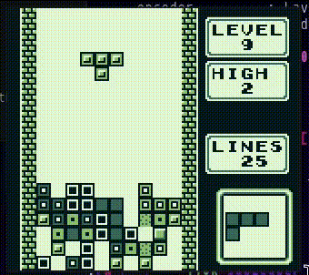
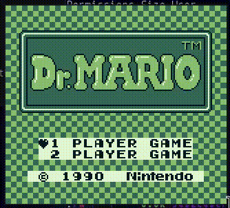
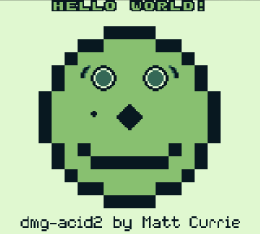

<a id="readme-top"></a>
<!--
*** Thanks for checking out the Best-README-Template. If you have a suggestion
*** that would make this better, please fork the repo and create a pull request
*** or simply open an issue with the tag "enhancement".
*** Don't forget to give the project a star!
*** Thanks again! Now go create something AMAZING! :D
-->


<!-- PROJECT SHIELDS -->
<!--
*** I'm using markdown "reference style" links for readability.
*** Reference links are enclosed in brackets [ ] instead of parentheses ( ).
*** See the bottom of this document for the declaration of the reference variables
*** for contributors-url, forks-url, etc. This is an optional, concise syntax you may use.
*** https://www.markdownguide.org/basic-syntax/#reference-style-links
-->
[![Contributors][contributors-shield]][contributors-url]
[![Forks][forks-shield]][forks-url]
[![Stargazers][stars-shield]][stars-url]
[![Issues][issues-shield]][issues-url]
[![Unlicense License][license-shield]][license-url]
<!-- [![LinkedIn][linkedin-shield]][linkedin-url] -->

<!-- PROJECT LOGO -->
<br />
<div align="center">
  <a href="https://github.com/Majestic9169/ppGB-emu">
    
  </a>

  <h3 align="center">plusplusGameBoy Emulator</h3>

  <p align="center">
    A GameBoy emulator written in C++
    <br />
    <!-- <a href="https://github.com/Majestic9169/ppGB-emu/wiki"><strong>Explore the docs »</strong></a> -->
    <!-- <br /> -->
    <br />
    <!-- <a href="https://github.com/Majestic9169/ppGB-emu">View Demo</a> -->
    <!-- &middot; -->
    <a href="https://github.com/Majestic9169/ppGB-emu/issues/new?labels=bug&template=bug-report---.md">Report Bug</a>
    &middot;
    <a href="https://github.com/Majestic9169/ppGB-emu/issues/new?labels=enhancement&template=feature-request---.md">Request Feature</a>
  </p>
</div>

<!-- TABLE OF CONTENTS -->
<details>
  <summary>Table of Contents</summary>
  <ol>
    <li>
      <a href="#about-the-project">About The Project</a>
      <ul>
        <li><a href="#built-with">Built With</a></li>
      </ul>
    </li>
    <li>
      <a href="#getting-started">Getting Started</a>
      <ul>
        <li><a href="#prerequisites">Prerequisites</a></li>
        <li><a href="#usage">Usage</a></li>
        <li><a href="#tests">Tests</a></li>
      </ul>
    </li>
    <li><a href="#further-plans">Further Plans</a></li>
    <li><a href="#known-issues">Known Bugs</a></li>
    <li><a href="#top-contributors">Top Contributors</a></li>
  </ol>
</details>
 
---

<!-- ABOUT THE PROJECT -->
## About The Project

ppGB (plus plus GameBoy emulator) is a GameBoy Emulator written in C++. 

This project aims to implement a basic featured Gameboy Emulator that will
allow the user to play simple games like Tetris.

It is my attempt at learning more about best practices, modern c++, computer architecture, and much more


| |   |
| ------------------------------------- | ---------------------------------- | 
|  | | 
|  |  |   


<p align="right">(<a href="#readme-top">back to top</a>)</p>

### Built With

[](#) 
[](https://github.com/sebmestrallet/absurd-badges)
[](https://github.com/sebmestrallet/absurd-badges)

<p align="right">(<a href="#readme-top">back to top</a>)</p>

---

<!-- GETTING STARTED -->
## Getting Started

### Prerequisites

This project uses ~~SDL3~~ SDL2 as a dependency

You can install SDL2 on Arch Linux from the extra repository as 

```bash
sudo pacman -S sdl2
```

On linux mint and similar systems

```bash
sudo apt-get install libsdl2-2.0.0
```

### Usage

**Quick Start:**

```bash
./build.sh
./build/ppGB-emu ./roms/fairylake.gb # you need a gb rom installed
```

a `build.sh` convenience script is provided. You can set `$ROM` in the script then use as below

```bash
Usage
  ./build.sh to build main executable and tests
  ./build.sh -r to run $ROM
  ./build.sh -d to run $ROM with debug information printed
  ./build.sh -t to run tests on a default rom you can set in `./tests/test_globals.cpp`
  ./build.sh -p to run code coverage on the tests
  ./build.sh -g to run code perf+flamegraph profiling on the emulator
  ./build.sh -c to clean the build folder
```

this is currently for convenience in developing, i will make this easier to use later

### Tests

To build and run tests you need the [Catch2 v3](https://github.com/catchorg/Catch2) and [nlohmann/json](https://github.com/nlohmann/json?tab=readme-ov-file) dependencies

You can build Catch2 v3 from source as 

```bash
git clone https://github.com/catchorg/Catch2.git
cd Catch2
cmake -Bbuild -H.
sudo cmake --build build --target install
```

on Arch you can install `nlohmann/json` as 

```bash
sudo pacman -S nlohmann-json
```

alternatively you could add the [`json.hpp`](https://raw.githubusercontent.com/nlohmann/json/refs/heads/develop/single_include/nlohmann/json.hpp) to [`include/`](./include/) and change the line in [`./tests/sm83_tests.cpp`](./tests/sm83_tests.cpp) to 

```cpp
#include "../include/json.hpp"
```

Then make sure you add the git submodule for the sm83 tests

```bash
git submodule update --init
```

- The purpose of `nlohmann/json` is to incorporate the [Single Step sm83 Tests](https://github.com/singlesteptests/sm83), a massive suite of cpu tests.
- [gameboy-doctor](https://github.com/robert/gameboy-doctor?tab=readme-ov-file) helped a little with debugging the cpu too

```bash
❯ ./build.sh -t
=====================================================
RNG seed: 1613788928
All tests passed (6190205 assertions in 31 test cases)
```

The tests need a ROM to be loaded which you can edit in the [`./tests/test_globals.cpp`](./tests/test_globals.cpp) file

```cpp
char *argv[2] = {strdup("./tests"), strdup("./roms/sgb_bios.bin")};
```

The choice of ROM is irrelevant for the tests to function (i realise this is kinda dumb, i will fix it when i care enough)

---

## Further Plans

- [ ] The Timer needs to be implemented
- [ ] Memory Bank Controllers needs to be implemented to support larger games
- [ ] Serial port functionality needs to be implemented
- [ ] Add an SDL back buffer for screen updates
- [ ] Refactor and clean up a bunch of stuff (mostly debugging helpers)
- [ ] Add more unit tests, I realised how incomplete my testsuite is recently
- [ ] more modern c++!!!
- [ ] Audio support some day???

## Known Bugs

- [ ] DMG-Acid2 Left mole is visible, this is because overlapping sprite priority on the same scanline is not handled
- [ ] Timing Oddities and other cycle accuracy issues
- [ ] joypad starts out with all keys pressed
- [ ] a few of the assertions in the sm83 test-suite also fail (like 10 of them) which i believe has to do with the above issue

---

<!-- CONTRIBUTING -->
## Top contributors

<a href="https://github.com/Majestic9169/ppGB-emu/graphs/contributors">
  
</a>

<p align="right">(<a href="#readme-top">back to top</a>)</p>

<!-- APPENDIX -->
## Acknowledgements

- [GameBoy GIF](https://codepen.io/heero/pen/DpBZzz)
- [GBdev.io](https://gbdev.io/)
- [Pan Docs](https://gbdev.io/pandocs/About.html)
- [GameBoy Instruction Set](https://gbdev.io/gb-opcodes/optables/)
- [Imran Nazar: GameBoy Emulation in Javascript](https://imrannazar.com/gameboy-Emulation-in-JavaScript)
- [Cinoop](https://cturt.github.io/cinoop.html): stole CPU timings and eventually will make disassembler
- [MagenBoy](https://github.com/alloncm/MagenBoy): Helped me with the FIFO a little
- [Lazy Stripes](https://blog.tigris.fr/category/emulator/): Palette Stuff. Very detailed in general

---

<!-- MARKDOWN LINKS & IMAGES -->
<!-- https://www.markdownguide.org/basic-syntax/#reference-style-links -->
[contributors-shield]: https://img.shields.io/github/contributors/Majestic9169/ppGB-emu.svg?style=for-the-badge
[contributors-url]: https://github.com/Majestic9169/ppGB-emu/graphs/contributors
[forks-shield]: https://img.shields.io/github/forks/Majestic9169/ppGB-emu.svg?style=for-the-badge
[forks-url]: https://github.com/Majestic9169/ppGB-emu/network/members
[stars-shield]: https://img.shields.io/github/stars/Majestic9169/ppGB-emu.svg?style=for-the-badge
[stars-url]: https://github.com/Majestic9169/ppGB-emu/stargazers
[issues-shield]: https://img.shields.io/github/issues/Majestic9169/ppGB-emu.svg?style=for-the-badge
[issues-url]: https://github.com/Majestic9169/ppGB-emu/issues
[license-shield]: https://img.shields.io/github/license/Majestic9169/ppGB-emu.svg?style=for-the-badge
[license-url]: https://github.com/Majestic9169/ppGB-emu/blob/master/LICENSE.txt
